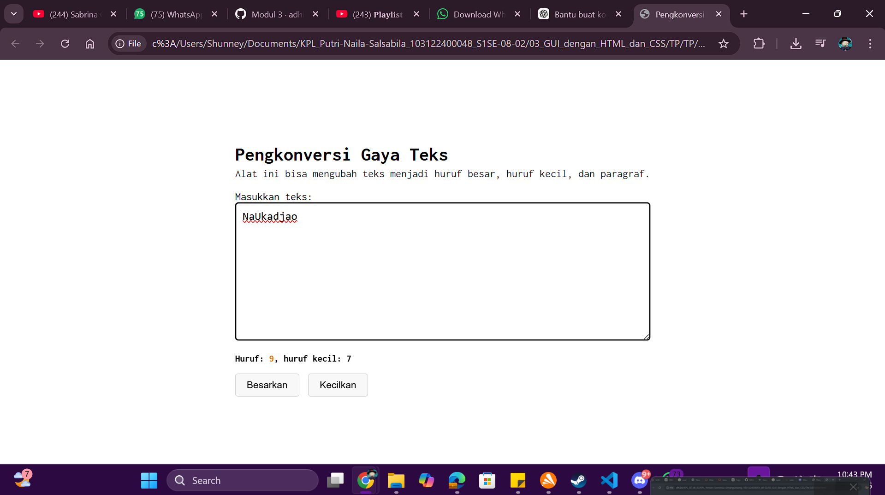

# Tugas Mandiri: GUI DENGAN CSS, JS, HTML

**Nama:** Putri Naila Salsabila
**NIM:** 103122400048 
**Kelas:** SE-08-02

## Program/Kode

Tersedia di [index.css](../TM/index.css) [index.html](../TM/index.html) dan [index.js](../TM/index.js)

## Output

.

## Deskripsi

aplikasi berbasis html ini berfungsi untuk mengkonversi gaya teks menjadi Huruf yang bisa dibesarkan semua, atau bisa di kecilkan semua, program ini juga bisa menghitung huruf kecil dan tidak mengincludekan huruf besar