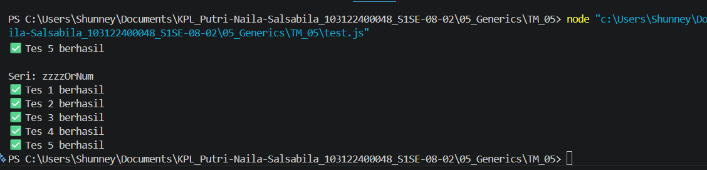

# Tugas Mingguan: GENERICS

**Nama:** Putri Naila Salsabila
**NIM:** 103122400048 
**Kelas:** SE-08-02

## Program/Kode

Tersedia di [fizz.js](../TM_05/fizz.js) 

## Output

.

## Deskripsi

Program terdiri dari dua fungsi utama, yaitu zzzzOrNum untuk menentukan apakah sebuah angka akan dikembalikan sebagai "Fizz", "Buzz", "FizzBuzz", atau angka itu sendiri berdasarkan aturan kelipatan 3 dan/atau 5, serta fizzBuzz yang memproses sebuah array angka dengan menerapkan fungsi tersebut ke setiap elemen. Selain itu, program juga dilengkapi dengan validasi input untuk memastikan bahwa data yang diberikan sesuai (angka untuk fungsi pertama dan array angka untuk fungsi kedua), sehingga dapat melempar error jika terjadi kesalahan.