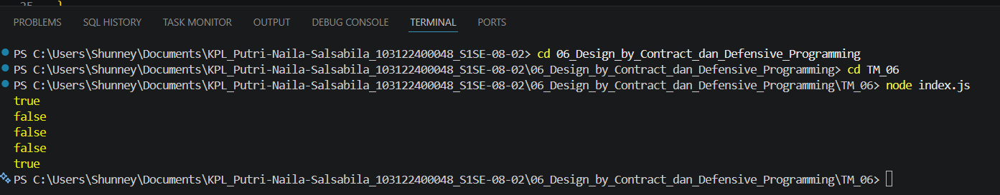

# Tugas Mingguan: Design by Contract

**Nama:** Putri Naila Salsabila
**NIM:** 103122400048 
**Kelas:** SE-08-02

## Program/Kode

Tersedia di [index.js](../TM_06/index.js)

## Output

.

## Deskripsi

Program yang memiliki fungsi untuk menolak bilangan-bilangan kelipatan 3, 5, atau 15, menerima bilangan-bilangan bukan "fizz buzz", dan melempar yang bukan bilangan bulat.
