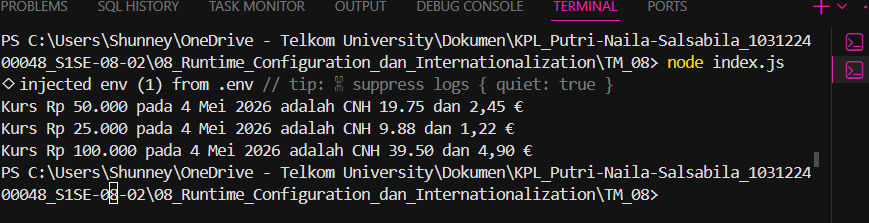

# Tugas Pendahuluan: Runtime Configuration dan Internationalization

**Nama:** Putri Naila Salsabila
**NIM:** 103122400048 
**Kelas:** SE-08-02

## Program/Kode

Tersedia di [index.js](../TM_08/index.js) 
Tersedia di [package.json](../TM_08/package.json) 
Tersedia di [package-lock.json](../TM_08/package-lock.json) 

## Output

.

## Deskripsi

Program ini adalah aplikasi Node.js sederhana yang mengambil data kurs mata uang dari sebuah API menggunakan **axios**, lalu mengonversi sejumlah uang dalam rupiah (IDR) ke mata uang yuan Tiongkok (CNH/CNY) dan euro (EUR). URL API disimpan di file `.env` dan diakses menggunakan **dotenv** agar lebih aman. Setelah mendapatkan data kurs, program menghitung hasil konversi berdasarkan jumlah uang yang dimasukkan, kemudian memformat angka dan tanggal menggunakan `Intl.NumberFormat` dan `Intl.DateTimeFormat` supaya tampil rapi sesuai format lokal. Terakhir, hasilnya ditampilkan di terminal dalam bentuk kalimat yang mudah dibaca.
