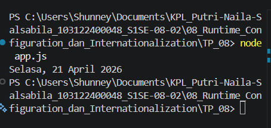

# Tugas Pendahuluan: Runtime Configuration dan Internationalization

**Nama:** Putri Naila Salsabila
**NIM:** 103122400048 
**Kelas:** SE-08-02

## Program/Kode

Tersedia di [app.js](../TP_08/app.js) 
Tersedia di [i18n.js](../TP_08/config/i18n.js) 
Tersedia di [dateService.js](../TP_08/services/dateService.js) 
Tersedia di [dateFormatter.js](../TP_08/utils/dateFormatter.js) 

## Output

.

## Deskripsi

Program tersebut menggunakan fitur internationalization (i18n) bawaan JavaScript, yaitu Intl.DateTimeFormat, untuk memformat tanggal menjadi tampilan yang sesuai dengan bahasa dan format lokal Indonesia (id-ID). Dengan menentukan opsi seperti weekday, day, month, dan year, program dapat menghasilkan output tanggal lengkap seperti “Sabtu, 18 April 2026” tanpa perlu menyusun string secara manual. Selain itu, pendekatan ini mendukung runtime configuration, sehingga format atau bahasa dapat dengan mudah diubah (misalnya ke en-US atau fr-FR) tanpa mengubah logika utama program. Hal ini membuat kode lebih fleksibel, rapi, dan siap digunakan dalam aplikasi multibahasa.