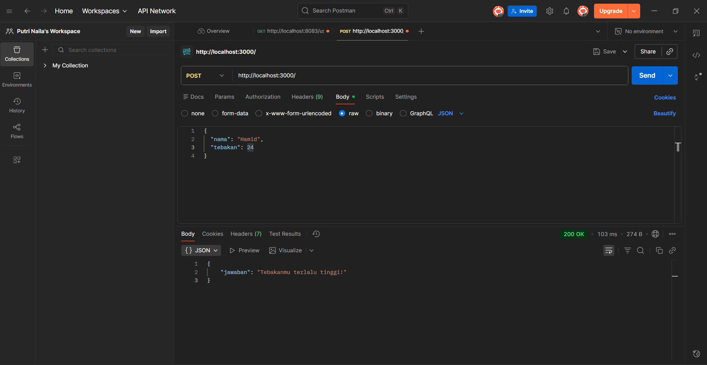

# Tugas Pendahuluan: API Design and Construction with stagger

**Nama:** Putri Naila Salsabila
**NIM:** 103122400048 
**Kelas:** SE-08-02

## Program/Kode

Tersedia di [index.js](../TM_09/index.js) 
Tersedia di [package.json](../TM_09/package.json) 
Tersedia di [package-lock.json](../TM_09/package-lock.json) 

## Output

.

## Deskripsi

Program ini adalah sebuah API sederhana berbasis Node.js dengan framework Express yang digunakan untuk permainan tebak angka. API ini memiliki satu endpoint yaitu POST / yang menerima input berupa nama dan angka tebakan dalam format JSON. Program kemudian mengolah nama tersebut menggunakan sebuah fungsi untuk menghasilkan angka unik yang tetap (tidak berubah setiap request) dalam rentang 1 sampai 100. Setelah itu, angka tebakan pengguna dibandingkan dengan angka yang dihasilkan. Jika sama, maka akan mengembalikan pesan bahwa tebakan benar; jika lebih besar, akan diberi pesan bahwa tebakan terlalu tinggi; dan jika lebih kecil, akan diberi pesan bahwa tebakan terlalu rendah. Program ini tidak menggunakan angka acak biasa, melainkan menghitungnya dari nama sehingga hasilnya konsisten untuk setiap nama yang sama.

