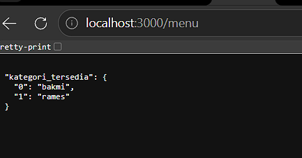

# Tugas Pendahuluan: API Design and Construction with stagger

**Nama:** Putri Naila Salsabila
**NIM:** 103122400048 
**Kelas:** SE-08-02

## Program/Kode

Tersedia di [index.js](../TP_09/index.js) 
Tersedia di [package.json](../TP_09/package.json) 
Tersedia di [package-lock.json](../TP_09/package-lock.json) 

## Output

.

## Deskripsi

Program ini merupakan aplikasi sederhana berbasis **Node.js** yang menggunakan framework **Express** untuk membuat server API. Server dijalankan pada port 3000 dan memiliki beberapa endpoint, yaitu endpoint utama (`/`) yang menampilkan pesan petunjuk untuk melihat dokumentasi API, serta endpoint `/menu` yang mengembalikan data kategori menu dalam format JSON. Data menu disimpan dalam bentuk objek yang berisi daftar kategori seperti “bakmi” dan “rames”. Program ini menunjukkan bagaimana membuat server dasar, mendefinisikan route (endpoint), serta mengirimkan response ke client dalam bentuk JSON.

