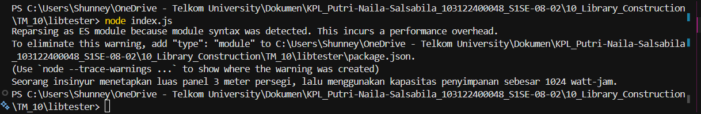

# Tugas Pendahuluan: Library Construction

**Nama:** Putri Naila Salsabila
**NIM:** 103122400048 
**Kelas:** SE-08-02

## Program/Kode

Tersedia di [index.js](../TM_10/mtk-gampang/index.js) 
Tersedia di [package.json](../TM_10/mtk-gampang/package.json) 
Tersedia di [bulat.js](../TM_10/mtk-gampang/lib/bulat.js) 
Tersedia di [kuadrat.js](../TM_10/mtk-gampang/lib/kuadrat.js) 
Tersedia di [pangkat.js](../TM_10/mtk-gampang/pangkat.js) 

## Output

.

## Deskripsi
Program ini merupakan sebuah pustaka (library) JavaScript sederhana bernama mtk-gampang yang berisi beberapa fungsi matematika dasar. Library dibuat menggunakan konsep modularisasi ES Module sehingga setiap fungsi ditempatkan pada file terpisah di dalam folder lib.

Library ini memiliki tiga fungsi utama:

1. pangkat(x, y)
Digunakan untuk menghitung nilai perpangkatan dari x terhadap y.
2. bulat(x)
Digunakan untuk membulatkan bilangan desimal menjadi bilangan bulat terdekat.
3. kuadrat(x)
Digunakan untuk menghitung akar kuadrat dari suatu bilangan.

Semua fungsi diekspor melalui file index.js sehingga pengguna library dapat mengakses seluruh fungsi hanya dari satu file utama tanpa perlu mengakses folder lib secara langsung.

Program ini juga mendukung instalasi lokal menggunakan npm install sehingga library dapat digunakan kembali pada project JavaScript lainnya.