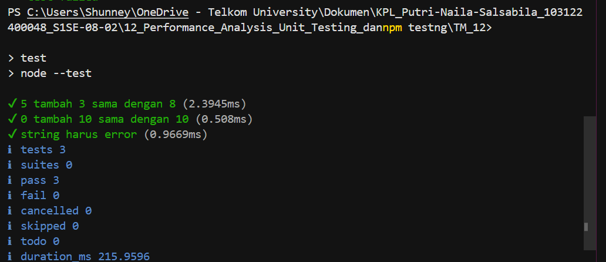

# Tugas Pendahuluan: Peformance analysis

**Nama:** Putri Naila Salsabila
**NIM:** 103122400048 
**Kelas:** SE-08-02

## Program/Kode

Tersedia di [hitung.js](../TM_12/hitung.js) 
Tersedia di [package.json](../TM_12/package.json) 
Tersedia di [hitung.test.js](../TM_12/hitung.test.js) 

## Output

.

## Deskripsi

Kode pada soal sebenarnya sudah benar dalam melakukan proses penjumlahan, karena fungsi tambahPengitung berhasil menambahkan nilai terkini dengan jumlah lalu mengembalikan hasilnya. Pengujian pada file hitung.test.js juga sudah sesuai karena menggunakan assert.strictEqual() untuk memastikan hasil penjumlahan sama dengan nilai yang diharapkan, seperti 5 + 3 = 8 dan 0 + 10 = 10. Namun, terdapat satu bagian yang perlu diperbaiki yaitu pada file hitung.js fungsi tambahPengitung belum menggunakan export. Karena pada file test fungsi tersebut dipanggil menggunakan import, maka fungsi harus diekspor terlebih dahulu dengan menambahkan kata export di depan function. Jika tidak ditambahkan, program akan menghasilkan error karena fungsi tidak dapat ditemukan saat proses import dilakukan.