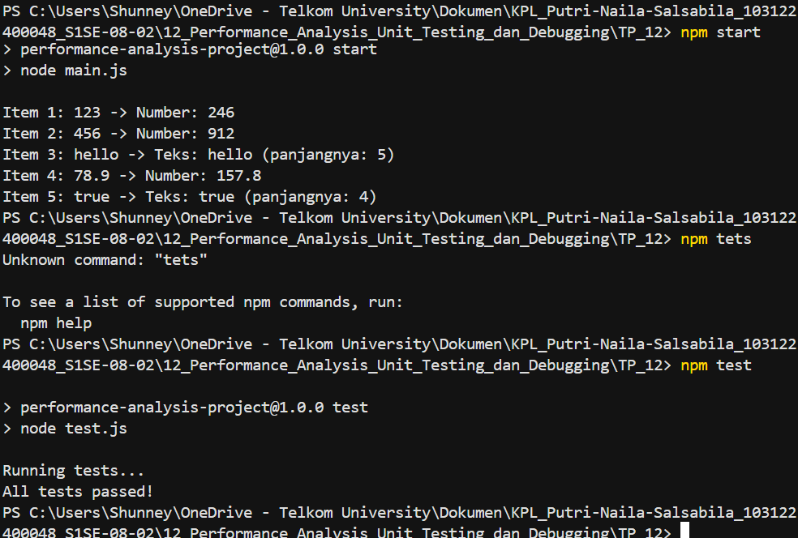

# Tugas Pendahuluan: Peformance analysis

**Nama:** Putri Naila Salsabila
**NIM:** 103122400048 
**Kelas:** SE-08-02

## Program/Kode

Tersedia di [main.js](../TP_12/main.js) 
Tersedia di [package.json](../TP_12/package.json) 
Tersedia di [test.js](../TP_12/test.js) 
Tersedia di [processData.js](../TP_12/processData.js) 

## Output

.

## Deskripsi

Program ini dibuat untuk memproses berbagai tipe data seperti string, number, dan boolean menggunakan JavaScript. Program akan mengecek apakah data berupa angka atau teks, kemudian menampilkan hasil sesuai jenis datanya. Selain itu, project ini digunakan untuk mempelajari debugging, unit testing, dan analisis performa sederhana dalam proses pengembangan software.
